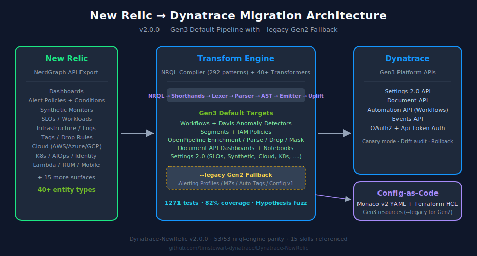
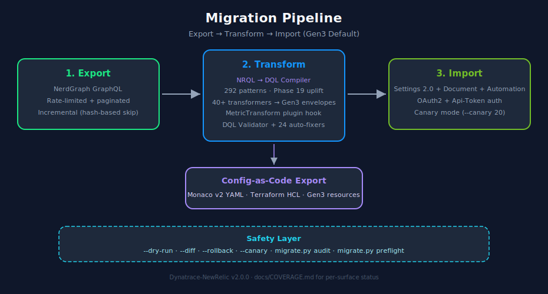
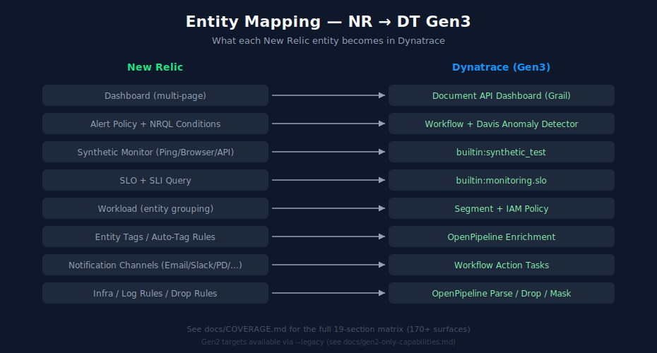

# Dynatrace-NewRelic

[](https://www.python.org/downloads/)
[](https://opensource.org/licenses/MIT)

> **⚠️ DISCLAIMER:** This project is not officially supported by Dynatrace. It is provided as-is for community use. Use at your own discretion and risk. For official Dynatrace migration support, please contact your Dynatrace account team.

Utilities for migrating from New Relic to Dynatrace.

## New Relic to Dynatrace Migration Framework

A universal, comprehensive migration framework for converting New Relic monitoring configurations to Dynatrace. Includes a built-in NRQL-to-DQL compiler with 292 tested patterns and 894 tests.

### Architecture



### Supported Components (Gen3 default)

| Component         | New Relic                      | →   | Dynatrace (Gen3)                                   | Status  |
| ----------------- | ------------------------------ | --- | -------------------------------------------------- | ------- |
| **Dashboards**    | Dashboard (multi-page)         | →   | Document API dashboard (Grail DQL tiles)           | ✅ Full |
| **Alerts**        | Alert Policy + NRQL Conditions | →   | Workflow + `builtin:davis.anomaly-detectors`       | ✅ Full |
| **Synthetics**    | Ping/Browser/API Monitors      | →   | `builtin:synthetic_test`                           | ✅ Full |
| **SLOs**          | Service Level Objectives       | →   | `builtin:monitoring.slo`                           | ✅ Full |
| **Workloads**     | Entity Groupings               | →   | `builtin:segment` + bucket-scoped IAM policy       | ✅ Full |
| **Notifications** | Channels (Email, Slack, etc.)  | →   | Workflow action tasks                              | ✅ Full |
| **Tags**          | Entity tags                    | →   | OpenPipeline enrichment (`builtin:openpipeline.*`) | ✅ Full |
| **Log rules**     | Parsing + drop rules           | →   | OpenPipeline `parse` / `drop` processors           | ✅ Full |

### Gen2 (classic tenant) compatibility

If your Dynatrace tenant does not yet have Gen3 features (Workflows,
Segments, OpenPipeline, Document API), run every CLI command with the
`--legacy` flag or set `MIGRATION_LEGACY_MODE=true` in `.env`:

```bash
python migrate.py preflight                        # probe tenant capability
python migrate.py migrate --legacy --dry-run       # Gen2 path
python migrate.py export-monaco --legacy --input ./output --output ./monaco
python migrate.py export-terraform --legacy --input ./output --output ./tf
```

Legacy mode emits the classic entities — Alerting Profiles, Metric Events,
Management Zones, Auto-Tag Rules, Problem Notifications, and Config v1
dashboards/synthetics/SLOs. This path is a stop-gap; it will be removed
once Gen3 rollout is complete on supported tenants.

> The `nrql-engine` repo will relocate to `dynatrace-dma` in an upcoming
> release. URLs in generated artifacts and docs will be repointed via a
> follow-up patch release.

### Pipeline



### CLI subcommand reference (current as of Phase 20)

| Subcommand | What it does |
|---|---|
| `migrate` | Run a full migration (export → transform → import). Supports `--full`, `--export-only`, `--import-only`, `--dry-run`, `--components`, `--rollback <file>`, `--retry <file>`, `--resume`, `--incremental`, `--report`, `--diff`, `--legacy`, `--canary <pct>`, `--canary-auto-proceed`. |
| `compile` | NRQL → DQL one-off, with `--interactive`, `--file`, `--validate`. |
| `convert` | NRQL → DQL with full post-processing + auto-fix. |
| `batch` | CSV / Excel batch compile with NRQL column. |
| `reference` | Print NRQL → DQL reference table; `--mappings` for the full mapping tables. |
| `audit-slos` | Audit DT SLOs against live metrics for missing/invalid keys. |
| `preflight` | **Phase 14.** Probe target tenant for Gen3 API availability; suggests `--legacy` if any Gen3 surface is missing. |
| `agents` | **Phase 16.** Per-language APM-agent migration action plans (`--language java/dotnet/nodejs/python/ruby/php/go`, `--phase`, `--dry-run`). |
| `scan-instrumentation` | **Phase 16.** Scan source for `newrelic.*()` SDK calls and emit suggested DT replacements. |
| `archive` | **Phase 17.** Pre-decommission NRDB JSONL snapshot (resumable). |
| `audit` | **Phase 20.** Diff a baseline export vs the live tenant. Reports DELETED / RENAMED / MODIFIED / EXTRA. Exits 1 on drift. |
| `export-monaco` | Emit Monaco v2 project (Gen3 default; `--legacy` for Gen2). |
| `export-terraform` | Emit Terraform HCL (Gen3 default; `--legacy` for Gen2). |

See `docs/migration-coverage.md` for the per-surface ✅/🟡/🔴/⛔ map and
`docs/out-of-scope.md` for permanent exclusions.

### Quick Start

```bash
# Install
pip install -r requirements.txt

# Try it without any credentials
python migrate.py compile "SELECT count(*) FROM Transaction SINCE 1 hour ago"

# Configure for full migration (create .env file)
cp .env.example .env
# Edit .env with your credentials

# Run migration
python migrate.py migrate --dry-run  # Validate first
python migrate.py migrate --full     # Execute migration
```

For a detailed walkthrough with sample data, see [docs/quickstart.md](docs/quickstart.md).

### CLI Reference

| Command                                            | Description                                      |
| -------------------------------------------------- | ------------------------------------------------ |
| `python migrate.py migrate --full`                 | Complete migration (export → transform → import) |
| `python migrate.py migrate --export-only`          | Export from New Relic only                       |
| `python migrate.py migrate --import-only --input ./path` | Import to Dynatrace from previous export   |
| `python migrate.py migrate --components dashboards,alerts` | Migrate specific components              |
| `python migrate.py migrate --dry-run`              | Validate without making changes                  |
| `python migrate.py migrate --list-components`      | List available components                        |
| `python migrate.py compile "SELECT ..."`           | Compile a single NRQL query to DQL               |
| `python migrate.py compile --interactive`          | Interactive REPL for ad-hoc query conversion     |
| `python migrate.py compile --file queries.nrql`    | Batch compile queries from file                  |
| `python migrate.py compile --file q.nrql --output r.dql` | Batch compile with output file             |
| `python migrate.py convert "SELECT ..."`           | Compile with post-processing and auto-fixes      |
| `python migrate.py reference`                      | Show NRQL→DQL quick reference table              |
| `python migrate.py reference --mappings`           | Show full mapping tables                         |
| `python migrate.py batch --file queries.csv`       | Batch compile from CSV/Excel file                |
| `python migrate.py audit-slos`                     | Audit SLOs for metric validity                   |
| `python migrate.py export-monaco --input ./output` | Export as Monaco config-as-code (YAML)           |
| `python migrate.py export-terraform --input ./output` | Export as Terraform HCL                       |
| `python migrate.py migrate --diff`                 | Compare against live DT environment              |
| `python migrate.py migrate --retry failed.json`    | Retry previously failed entities                 |
| `python migrate.py migrate --report`               | Generate conversion quality report               |
| `python migrate.py --version`                      | Show version                                     |

### Entity Mapping



| New Relic           | Dynatrace                 | Notes                                  |
| ------------------- | ------------------------- | -------------------------------------- |
| Dashboard           | Dashboard                 | Each page becomes a separate dashboard |
| Alert Policy        | Alerting Profile          | 1:1 mapping                            |
| NRQL Condition      | Metric Event              | Query conversion (limited automation)  |
| APM Condition       | Auto-Adaptive Baseline    | Manual review recommended              |
| Synthetic (Ping)    | HTTP Monitor              | Direct mapping                         |
| Synthetic (Browser) | Browser Monitor           | Script adaptation needed               |
| Synthetic (API)     | HTTP Monitor (Multi-step) | Script adaptation needed               |
| SLO                 | SLO                       | Metric expression mapping              |
| Workload            | Management Zone           | Entity selector rules                  |
| Email Channel       | Email Notification        | Direct mapping                         |
| Slack Channel       | Slack Notification        | Webhook URL update needed              |
| PagerDuty           | PagerDuty Integration     | Service key recreation                 |
| Webhook             | Webhook Notification      | Payload format adjustment              |

---

## Project Structure

```
Dynatrace-NewRelic/
├── migrate.py                     # CLI entry point (migrate, compile, convert, reference, batch, export)
├── pyproject.toml                 # Project config + pip install
├── requirements.txt               # Python dependencies
├── .env.example                   # Environment template
├── _version.py                    # Version (1.2.0)
│
├── compiler/                      # NRQL-to-DQL AST compiler (292 tested patterns)
├── clients/                       # NR NerdGraph + DT API clients
├── config/                        # Pydantic settings from .env
├── transformers/                  # 10 entity transformers + NRQL converter
├── validators/                    # DQL syntax validator + auto-fixer
├── registry/                      # DTEnvironmentRegistry + SLOAuditor
├── migration/                     # Rollback, checkpoint, retry, diff, reports
├── exporters/                     # Monaco YAML + Terraform HCL exporters
├── utils/                         # Logging, auth, validators
├── examples/                      # Sample NRQL queries
├── tests/                         # 894 tests across 25 files
│
├── docs/                          # SVG diagrams + migration research
├── .github/workflows/ci.yml       # CI pipeline
└── CHANGELOG.md
```

## Required API Permissions

### New Relic API Key

| Permission            | Required For                  |
| --------------------- | ----------------------------- |
| NerdGraph access      | All exports                   |
| Dashboards (read)     | Dashboard export              |
| Alerts (read)         | Alert policy/condition export |
| Synthetics (read)     | Monitor export                |
| Service Levels (read) | SLO export                    |
| Workloads (read)      | Workload export               |

### Dynatrace API Token

| Scope                          | Required For                                 |
| ------------------------------ | -------------------------------------------- |
| `settings.read`                | Reading existing configs                     |
| `settings.write`               | Creating alerting profiles, management zones |
| `WriteConfig`                  | Creating dashboards                          |
| `ReadConfig`                   | Reading existing configs                     |
| `ExternalSyntheticIntegration` | Creating synthetic monitors                  |
| `slo.read` / `slo.write`       | SLO operations                               |

## Known Limitations

| Area                    | Limitation                                            | Workaround             |
| ----------------------- | ----------------------------------------------------- | ---------------------- |
| **NRQL → DQL**          | AST compiler covers 292 tested patterns; edge cases may need review | Manual query review    |
| **Scripted Synthetics** | Complex scripts not converted                         | Manual recreation      |
| **Entity References**   | GUIDs don't map to DT IDs                             | Manual linking         |
| **Dashboard Variables** | Limited filter conversion                             | Manual configuration   |
| **Dynamic Baselines**   | Not automatically converted                           | Manual threshold setup |
| **Historical Data**     | Not transferable                                      | N/A                    |

## Related Resources

- [New Relic NerdGraph API](https://docs.newrelic.com/docs/apis/nerdgraph/)
- [Dynatrace Settings API v2](https://docs.dynatrace.com/docs/dynatrace-api/environment-api/settings)
- [Dynatrace Monaco CLI](https://docs.dynatrace.com/docs/deliver/configuration-as-code/monaco)
- [Dynatrace Terraform Provider](https://github.com/dynatrace-oss/terraform-provider-dynatrace)

## Contributing

Contributions are welcome! Please feel free to submit issues or pull requests.

## License

MIT License - See LICENSE file for details.
